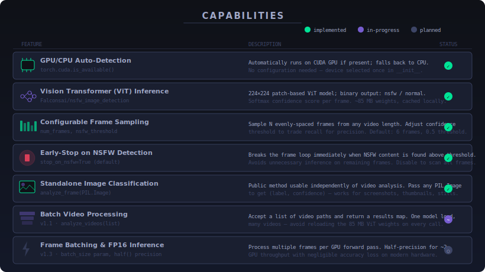
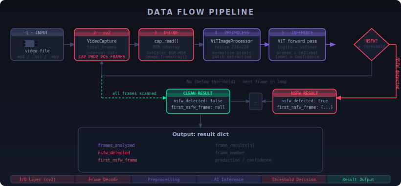
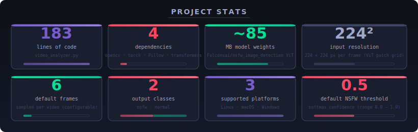

<div align="center">


**A ViT-based NSFW video scanner that runs entirely on your machine — no API keys, no uploads, no surprises.**

[Features](#features) • [Installation](#installation) • [Usage](#usage) • [Architecture](#architecture) • [Roadmap](#roadmap) • [License](#license)

</div>

---

*I built this because every "content moderation API" wants to upload your video to someone else's server. Sometimes you have content you can't send anywhere — and you still need to know what's in it.*

`video-nsfw` is a Python library and CLI tool for detecting NSFW content in video files using a Vision Transformer (ViT) model fine-tuned by [Falconsai](https://huggingface.co/Falconsai/nsfw_image_detection). It samples frames at even intervals, runs each one through the ViT classifier, and returns a structured result dict — including which frame tripped the detector and how confident the model was. It uses PyTorch for GPU-accelerated inference (with automatic CPU fallback), OpenCV for video I/O, and Hugging Face Transformers for model loading. The model weights (~85 MB) are cached locally after the first download; after that, the tool runs fully offline.

---


---

## System Overview

`video-nsfw` is a single-file library (`video_analyzer.py`) exposing one class with two public methods. The design is deliberately minimal — load the model once, run it against as many videos as you need.

```
video-nsfw/
├── video_analyzer.py      # The whole library. One class, two public methods.
├── requirements.txt       # Four dependencies.
├── LICENSE
└── wiki/
    ├── Architecture.md
    ├── Usage.md
    ├── Installation.md
    ├── Roadmap.md
    ├── Privacy.md
    ├── Troubleshooting.md
    └── Contributing.md
```

The model is loaded from HuggingFace Hub on first run and cached in `~/.cache/huggingface/`. All subsequent runs are offline. Frame extraction is handled by OpenCV; each frame is handed off to the ViT as a PIL Image. See the architecture diagram below for the full component picture.


---

## Features

| Feature | What it actually does |
|---|---|
| 🔍 **Frame sampling** | Seeks to `N` evenly-spaced positions in the video using `CAP_PROP_POS_FRAMES`, reads one frame each. Default is 6 frames. |
| ⚡ **GPU acceleration** | Calls `torch.cuda.is_available()` at init and moves both the model and all input tensors to CUDA. CPU fallback is automatic. |
| 🛑 **Early stop** | Breaks out of the frame loop the moment a frame exceeds `nsfw_threshold`. Skip the rest of the video the instant you have an answer. |
| 🎛️ **Configurable threshold** | `nsfw_threshold` (default `0.5`) is the minimum softmax confidence required to flag a frame. Raise it to 0.85 to cut false positives. |
| 🖼️ **Standalone image classification** | `analyze_frame(PIL.Image)` is a public method. Use it independently to classify screenshots, thumbnails, or any image — not just video frames. |
| 📦 **Structured output** | Returns a typed dict with `frames_analyzed`, `nsfw_detected`, `first_nsfw_frame`, and per-frame `frame_results`. No screen-scraping required. |
| 🔒 **Local-only processing** | No frames are written to disk by the library. No data leaves your machine. Network activity: one HTTPS download of model weights on first run. |
| 🎬 **Broad format support** | Any container OpenCV can decode: MP4, AVI, MKV, MOV, WebM, FLV. Format support depends on your OpenCV build's codec set. |

---

## Capability Visualization



---

## Architecture


`VideoContentAnalyzer.__init__` does the expensive work upfront: it selects the compute device, downloads (or loads from cache) the ViT model weights via `AutoModelForImageClassification.from_pretrained`, and loads the image preprocessor via `ViTImageProcessor.from_pretrained`. This happens once. Every call to `analyze_video` after that is just video I/O plus forward passes — no re-loading.

`analyze_video` opens the video with `cv2.VideoCapture`, computes a frame interval (`total_frames // num_frames`), and loops over the target positions. For each frame it: seeks → reads → converts BGR to RGB → wraps as PIL Image → calls `analyze_frame`. The `VideoCapture` handle is released in a `finally` block regardless of what happens in the loop. `analyze_frame` preprocesses the image to a 224×224 tensor, runs the model under `torch.no_grad()`, applies softmax, and maps the argmax index to a label string via `model.config.id2label`. The choice to keep these as two separate public methods means you can use `analyze_frame` directly on any PIL Image without touching the video pipeline.

---

## Data Flow



Primary path in brief:

```
video file
  └─ cv2.VideoCapture  ──→  seek to frame position
                             cap.read() → BGR ndarray
                             cvtColor(BGR→RGB) → PIL Image
                             ViTImageProcessor → pixel_values tensor
                             ViT forward pass → logits
                             softmax + argmax → (label, confidence)
                             confidence ≥ nsfw_threshold?
                               YES → set nsfw_detected, optionally break
                               NO  → continue to next frame
  └─ cap.release()
  └─ return result dict
```

---

## Installation

**Prerequisites:** Python 3.8 or newer. A CUDA-capable GPU is optional but speeds up inference significantly.

1. **Clone the repository**

   ```bash
   git clone https://github.com/Kaelith69/video-nsfw.git
   cd video-nsfw
   ```

2. **Create a virtual environment** (keeps your system Python clean)

   ```bash
   python -m venv .venv
   source .venv/bin/activate   # Windows: .venv\Scripts\activate
   ```

3. **Install dependencies**

   ```bash
   pip install -r requirements.txt
   ```

   | Package | Why it's needed |
   |---|---|
   | `opencv-python` | Video file I/O, frame seeking, BGR→RGB color conversion |
   | `torch` | Tensor operations, GPU device management, `no_grad` context |
   | `Pillow` | Wraps raw NumPy frames into `PIL.Image` for the preprocessor |
   | `transformers` | Loads the ViT model and `ViTImageProcessor` from HuggingFace Hub |

4. **First run — model download**

   The first time you run the analyzer, `transformers` will download the ViT model weights (~85 MB) from HuggingFace Hub to `~/.cache/huggingface/`. This requires an internet connection exactly once. After that, everything runs offline.

**Per-platform notes:**

| Platform | Notes |
|---|---|
| Linux | All packages install cleanly via pip. CUDA toolkit needed separately for GPU support. |
| macOS | CPU inference only (MPS support not tested). Works on Apple Silicon via Rosetta or native arm64. |
| Windows | Use `pip install torch` with the appropriate CUDA wheel from [pytorch.org](https://pytorch.org/get-started/locally/) if you want GPU. |

---

## Usage

### Primary workflow

1. **Initialize the analyzer** (loads the model — do this once)

   ```python
   from video_analyzer import VideoContentAnalyzer
   analyzer = VideoContentAnalyzer()
   ```

2. **Analyze a video**

   ```python
   results = analyzer.analyze_video("path/to/video.mp4")
   ```

3. **Inspect the results**

   ```python
   if results["nsfw_detected"]:
       frame = results["first_nsfw_frame"]
       print(f"NSFW at frame {frame['frame_number']} — {frame['confidence']:.1%} confidence")
   else:
       print(f"Clean ({results['frames_analyzed']} frames checked)")
   ```

4. **From the command line**

   ```bash
   python video_analyzer.py video.mp4
   ```

### Pro tip

If you're processing multiple videos, initialize `VideoContentAnalyzer()` **once** outside the loop. The ViT model weights are ~85 MB and take a non-trivial amount of time to load. Creating a new `VideoContentAnalyzer` inside a loop will reload the weights on every iteration.

```python
# ✓ Do this
analyzer = VideoContentAnalyzer()
for path in video_paths:
    results = analyzer.analyze_video(path)

# ✗ Not this
for path in video_paths:
    analyzer = VideoContentAnalyzer()  # reloads 85 MB weights every time
    results = analyzer.analyze_video(path)
```

### API options

```python
results = analyzer.analyze_video(
    video_path="video.mp4",   # str or Path
    num_frames=12,            # how many frames to sample (default: 6)
    stop_on_nsfw=False,       # scan all frames instead of stopping early
    nsfw_threshold=0.75,      # raise for fewer false positives (default: 0.5)
)
```

---

## Project Structure

```
video-nsfw/
├── 🐍 video_analyzer.py      # VideoContentAnalyzer class — the entire library
├── 📋 requirements.txt        # pip dependencies (4 packages)
├── 📄 LICENSE                 # MIT
└── 📚 wiki/
    ├── Home.md                # Overview
    ├── Architecture.md        # Deep-dive component walkthrough
    ├── Usage.md               # Full API reference + usage patterns
    ├── Installation.md        # Platform-specific setup guide
    ├── Roadmap.md             # Planned features (v1.1 → v2.0)
    ├── Privacy.md             # Data handling, network activity, security model
    ├── Troubleshooting.md     # Common errors and fixes
    └── Contributing.md        # PR process and guidelines
```

---

## Performance Stats



---

## Privacy

**What the library does with your data:**

- Video frames are decoded into RAM and immediately discarded after inference. No frames, thumbnails, or intermediate images are written to disk.
- Analysis results (labels and confidence scores — not image data) are returned to the caller. What you do with them is up to you.
- Network activity: one HTTPS request to `huggingface.co` on first run to download model weights (~85 MB). After that, nothing. Zero outbound traffic on subsequent runs.

**What the library does not do:**

- Does not upload video files or frames anywhere.
- Does not require API keys, accounts, or authentication.
- Does not log anything beyond what Python's standard `logging` module emits to your local console.

To enforce offline-only mode after the initial model download:

```python
import os
os.environ["TRANSFORMERS_OFFLINE"] = "1"
from video_analyzer import VideoContentAnalyzer
```

See [wiki/Privacy.md](wiki/Privacy.md) for the full data handling breakdown.

---

## Roadmap

**v1.1 — Usability**
- [ ] Batch video processing (`analyze_videos(list_of_paths)`)
- [ ] Progress callback (`on_frame` hook)
- [ ] `--json` flag for CLI output
- [ ] Expose `--num-frames`, `--threshold`, `--no-stop` as CLI arguments

**v1.2 — Accuracy**
- [ ] Scene-change-aware frame sampling (stop missing single-scene NSFW content)
- [ ] Confidence calibration (Platt scaling)
- [ ] Pluggable model backend (swap in CLIP-based classifiers)

**v1.3 — Performance**
- [ ] Frame batching (multiple frames per GPU forward pass)
- [ ] FP16 / half-precision inference
- [ ] Async/concurrent frame processing

**v1.4 — Deployment**
- [ ] FastAPI REST wrapper
- [ ] Official Docker image with model pre-cached
- [ ] Webhook support for detection events

**v2.0 — Multi-modal**
- [ ] Audio moderation (transcribe + classify)
- [ ] OCR text overlay detection
- [ ] Temporal context (video transformer for sequence-aware classification)

See [wiki/Roadmap.md](wiki/Roadmap.md) for priorities and planned APIs.

---

## Contributing

Bug reports, feature requests, and pull requests are welcome. See [wiki/Contributing.md](wiki/Contributing.md) for the PR process and contribution guidelines.

---

## Security

For security vulnerabilities, open a GitHub issue with the `security` label. For sensitive disclosures, contact the repository owner directly via GitHub. See [wiki/Privacy.md](wiki/Privacy.md) for the library's security model.

---

## License

MIT — see [LICENSE](LICENSE).

Built by [Kaelith69](https://github.com/Kaelith69).
